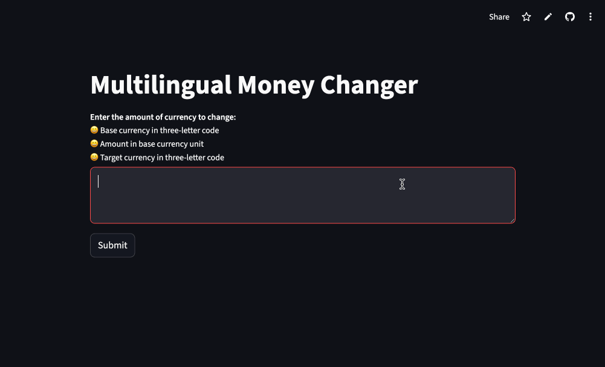

# Multilingual Money Changer 
<a href="https://moneychanger-by-xinmeixu.streamlit.app/" target="_blank">Currency Exchange Now!</a>

### 🌟 Features
- 🗣️ Accepts natural language input for currency conversion (e.g., "Convert 250 GBP to USD")
- 🧠 Leverages OpenAI GPT-4.1 with function-calling to parse inputs into structured data
- 🔁 Fetches real-time exchange rates via ExchangeRate-API
- 🕒 Converts timestamps to Pacific Time (PST)
- 📺 Displays result with human-readable formatting via Streamlit UI
- 🧪 Traced using LangSmith for debugging and observability

### 💻 App Interface

### 🧰 Tech Stack

| Layer              | Tools / Libraries                     |
|--------------------|----------------------------------------|
| Interface          | [Streamlit](https://streamlit.io)      |
| LLM                | OpenAI GPT-4.1 via GitHub Inference API |
| API Data Source    | [ExchangeRate-API](https://www.exchangerate-api.com/) |
| Environment Config | `dotenv`                               |
| Timezone Handling  | `datetime`, `zoneinfo`                 |
| Tracing            | [LangSmith](https://smith.langchain.com/) |
